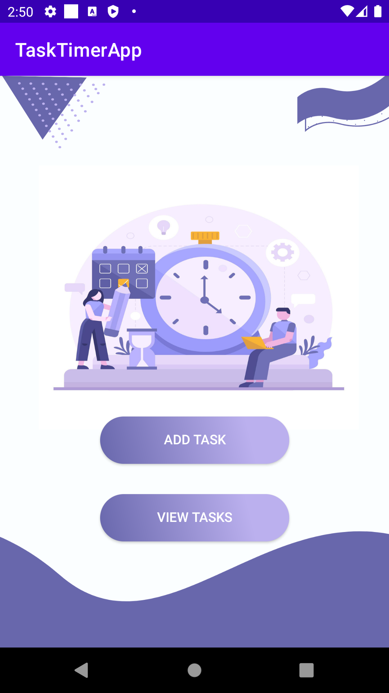
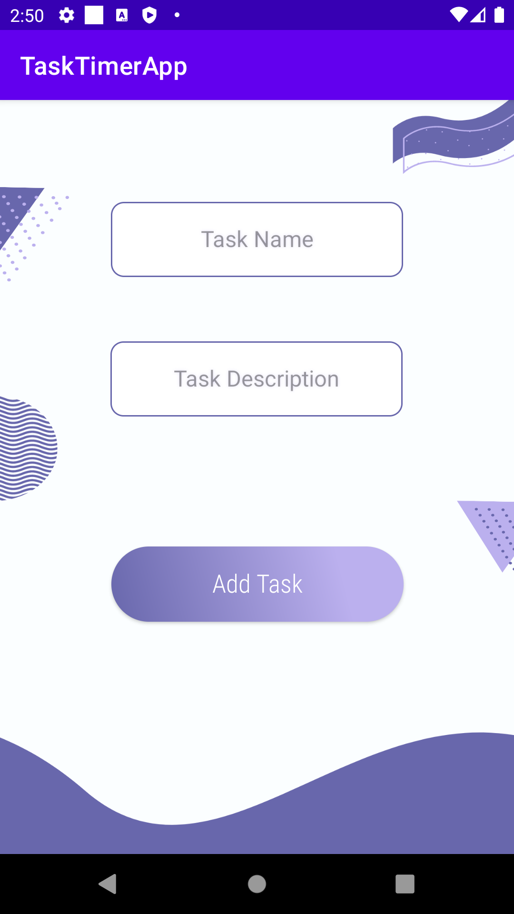
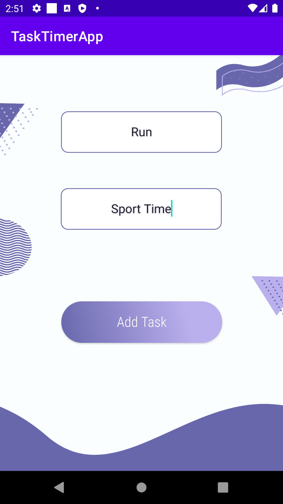
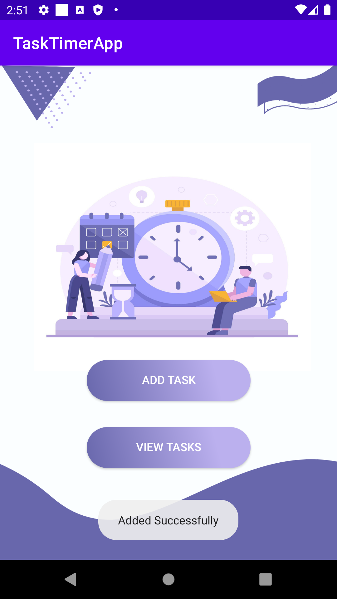
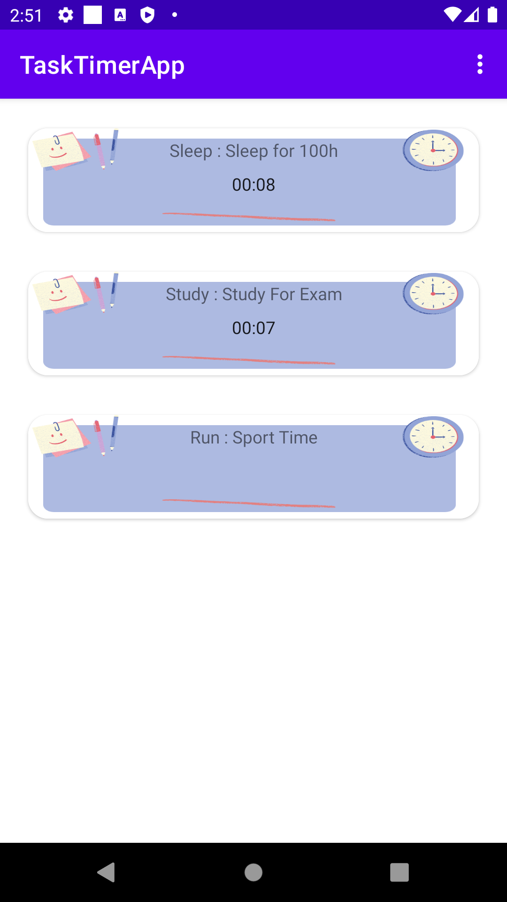

# TaskTimerApp

In this Repo You will find a full application where you can as user add tasks, view them, start timer for a task

## Screenshot

## Work Distribution:
    1 - UI : Amaal Al-Mutairi & Ameera Abdullah
    2 - Database : SQL -> Atheer Al-Aahmari & Rayana Omar | NoSQL "Firebase" -> Mohammad Al-Haddad
    3 - Logic : Atheer Al-Aahmari, Rayana Omar & Mohammad Al-Haddad
    4 - GitHub : Rayana Omar & Mohammad Al-Haddad